## T2A2 Marketplace Project - Ryan Cook

### R7 - Identification of the problem you are trying to solve by building this particular marketplace app.

Horse riding is a somewhat niche sport and leisure activity. According to Wikipedia, around 400,000 people in Australia ride horses, which makes out to be just over 1% of the population. Unfortunately, it can become quite expensive, especially when you're looking at transportation. You’re not often needing to transport your horse, but when you do, a new horse float starts on average at around AUD $20,000. For most, this is a lot of money to have invested in something that functionally sits there doing nothing for the majority of the time. This marketplace lets people who would otherwise not be able to afford or find horse transport, to have access at a lower price point, or access at all. It also provides a platform for owners of horse floats to generate some extra cash flow at times when they don’t need to use it for themselves.

Put simply, I'm connecting horse float owners with other horse enthusiasts who require the use of horse floats, for the betterment of the community.

### R8 - Why is it a problem that needs solving?

The main issue is accessibility - not being able to afford a horse float, or have anywhere to keep it (for example, apartment owners) shouldn’t mean that people don’t have access to one when required. It’s a small community, and floats are most often required for competitions (which many people from the same community will also be attending). As a result, there might not be one available in your small local community of riders. This opens up the possibility to connect with horse float owners from all over the city or region, who you would otherwise not be able to seek out and get in touch with. 

### R9 - A link (URL) to your deployed app (i.e. website)

```
https://air-float.herokuapp.com/
```

### R10 - A link to your GitHub repository (repo) - Ensure the repo is accessible by your Educators

```
https://github.com/theryancook/2-way-marketplace-rails
```

### R11 - Description of your marketplace app (website), including:
### - Purpose
### - Functionality / features
### - Sitemap
### - Screenshots
### - Target audience
### - Tech stack (e.g. html, css, deployment platform, etc)

#### Purpose
To have somewhere for people from the horse riding community to be able to find transport options for their horse when needed, as well as providing somewhere for horse float owners to generate some extra money while they’re not using their own float.

#### Functionality / features
User authentication - without being logged in, users are able to see the index of all the listings and summary information of those listings, but won’t be able to use any of the site functionality.

Logging in and signing up - users will then be able to see more detailed information on others listings, as well as being able to create their own listings. In the navigation bar, users can see which account they’re logged in as and a specific view of all their own listings.

Listings - Once the listing has been created, it can only be edited and deleted by the user who created the listing. If the current user is not the creator, that functionality is replaced by a payment link in order to rent the float.

Payments - Made through Stripe, fully integrated. Directs users back to the index automatically once the purchase has been authenticated by Stripe.

#### Sitemap
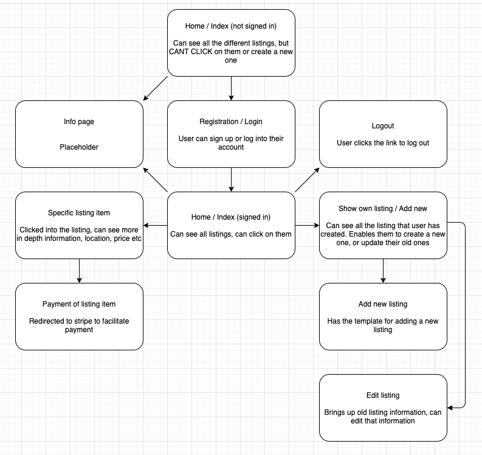

#### Screenshots
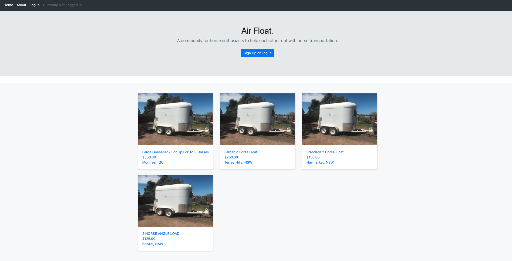

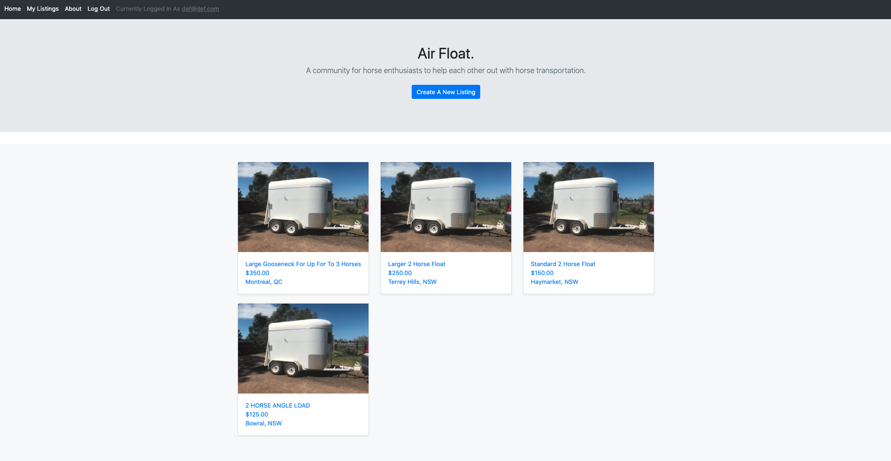

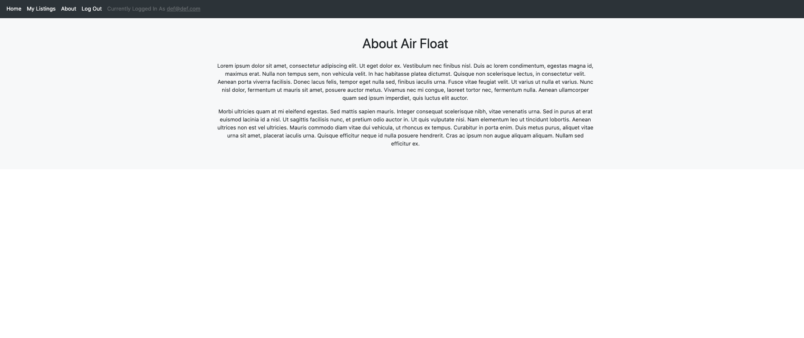

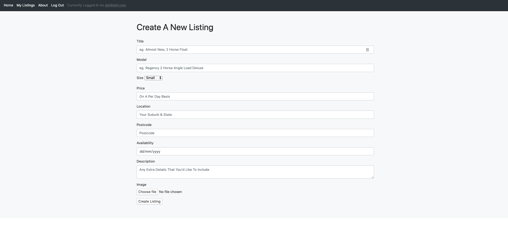

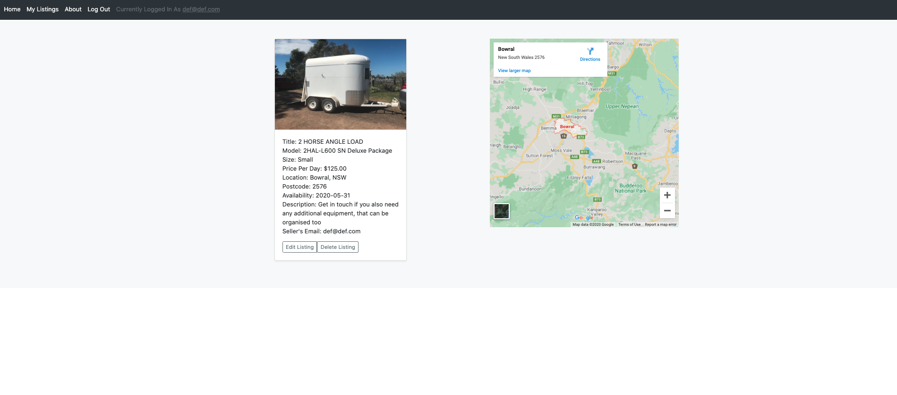

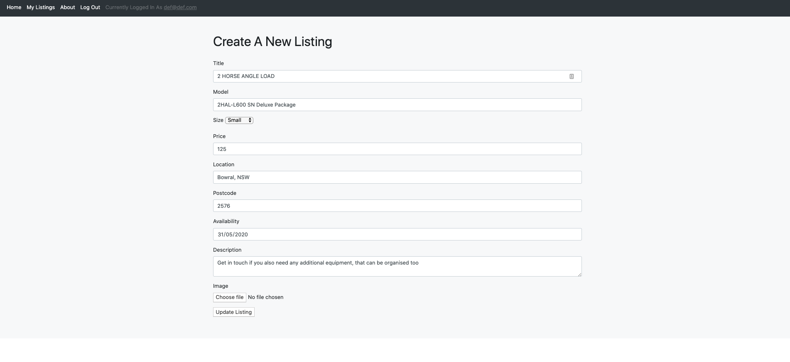

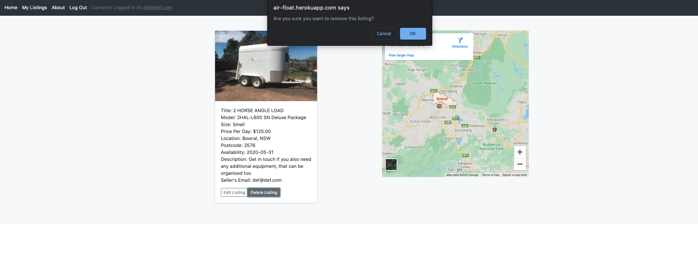

#### Target audience
Horse owners and riders, anyone who requires horse transportation.

#### Tech stack (e.g. html, css, deployment platform, etc)
* Ruby on Rails
* PostgreSQL
* Ruby
* HTML
* CSS
* Heroku
* AWS Simple Storage Service (S3)
* Stripe
* Bootstrap
* Goolgle Maps
* Gems: Devise

### R12 - User stories for your app

* As a user, you can view the index of all listings.
* As a user, you can log in or sign up, as well as log out.
* As a user, you can create your own listings.
* As a user, you can edit and delete any of the information from your own listing.
* As a user, you can see other listings with further details, including a map with location information.
* As a user, you can see a complete list of your own listings.
* As a user, you can pay for and lease horse floats from other users listings.

### R13 - Wireframes for your app

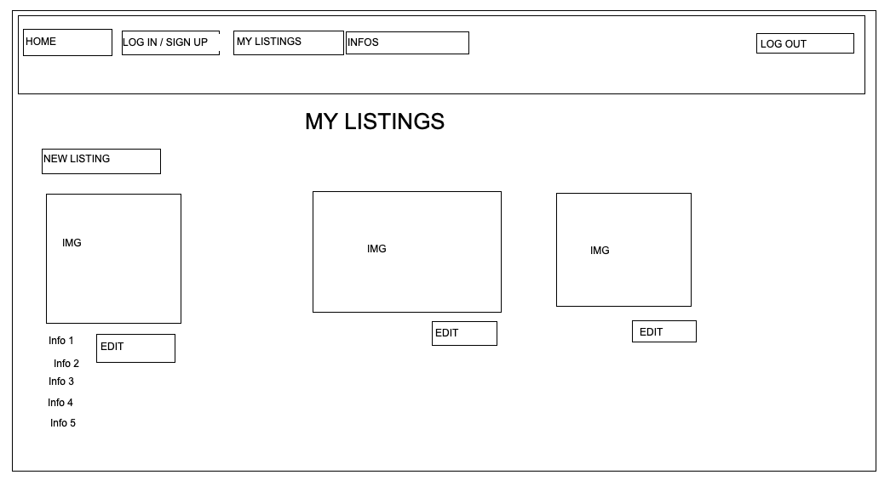

### R14 - An ERD for your app

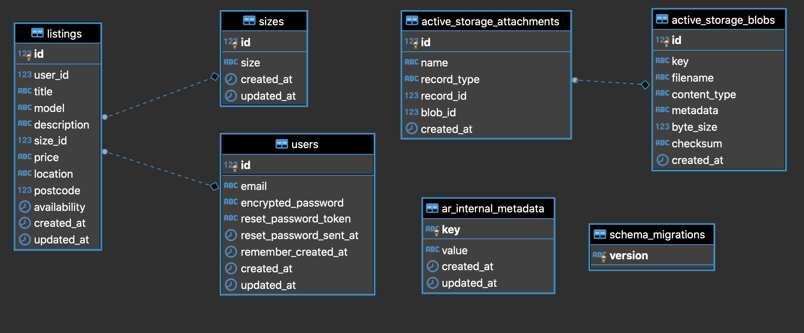

### R15 - Explain the different high-level components (abstractions) in your app

* We have an Index/Home page which displays every single listing of all the floats available.
* We have a My Listings page which displays only those listings belonging to the user who’s currently logged in.
* We have a Rails Form, which is accessed through Create A New Listing. This form has validation with error handling, and enables users to create a listing. The form will also let users edit their listing, simply by changing the information in that form. The listing can also be deleted through the form.
* We have Google Maps integration, which displays the location of the float in the listing.
* We have an integration with Stripe to facilitate payments for the 2 parties.

### R16 - Detail any third party services that your app will use

* Stripe - this is used to handle users payments.
* AWS S3 - used for scalable image storage and hosting.
* Heroku - fast, all-in-one web hosting service.
* Google Maps - displays the location on a map embedded on the site.
* Devise - Rails Gem that handles user authentication.
* Bootstrap - Rails Gem to implement simple and standardised styling.

### R17 - Describe your projects models in terms of the relationships (active record associations) they have with each other

#### User
* has_many :listings

#### Listings
* belongs_to :user
* belongs_to :size
* has_one_attached :picture (via S3)

#### Size
* has_one :listing

### R18 - Discuss the database relations to be implemented in your application

First of all, a user entity needs to be created and active to be able to interact with any of the features at all.

Once you have a user entity, you’ll then be able to create a listing which is attached to the user. All the fields in the listing form are required, and there will be error handling displayed that lets the user know if there’s any information missing (ensuring clean data in the database). We’ve got pre-loaded float sizes in the sizes entity of the database, which is accessible through the form as a drop down menu. If all aspects of the form are completed, then the user will be able to create a listing. The listing is then able to be edited and removed.

If the user subsequently deletes that listing, the information in the database will be deleted as well (again, clean database).

### R19 - Provide your database schema design

```
ActiveRecord::Schema.define(version: 2020_05_14_020731) do

  enable_extension "plpgsql"

  create_table "active_storage_attachments", force: :cascade do |t|
    t.string "name", null: false
    t.string "record_type", null: false
    t.bigint "record_id", null: false
    t.bigint "blob_id", null: false
    t.datetime "created_at", null: false
    t.index ["blob_id"], name: "index_active_storage_attachments_on_blob_id"
    t.index ["record_type", "record_id", "name", "blob_id"], name: "index_active_storage_attachments_uniqueness", unique: true
  end

  create_table "active_storage_blobs", force: :cascade do |t|
    t.string "key", null: false
    t.string "filename", null: false
    t.string "content_type"
    t.text "metadata"
    t.bigint "byte_size", null: false
    t.string "checksum", null: false
    t.datetime "created_at", null: false
    t.index ["key"], name: "index_active_storage_blobs_on_key", unique: true
  end

  create_table "listings", force: :cascade do |t|
    t.bigint "user_id"
    t.string "title"
    t.string "model"
    t.text "description"
    t.bigint "size_id"
    t.string "price"
    t.string "location"
    t.integer "postcode"
    t.date "availability"
    t.datetime "created_at", null: false
    t.datetime "updated_at", null: false
    t.index ["size_id"], name: "index_listings_on_size_id"
    t.index ["user_id"], name: "index_listings_on_user_id"
  end

  create_table "sizes", force: :cascade do |t|
    t.string "size"
    t.datetime "created_at", null: false
    t.datetime "updated_at", null: false
  end

  create_table "users", force: :cascade do |t|
    t.string "email", default: "", null: false
    t.string "encrypted_password", default: "", null: false
    t.string "reset_password_token"
    t.datetime "reset_password_sent_at"
    t.datetime "remember_created_at"
    t.datetime "created_at", null: false
    t.datetime "updated_at", null: false
    t.index ["email"], name: "index_users_on_email", unique: true
    t.index ["reset_password_token"], name: "index_users_on_reset_password_token", unique: true
  end

  add_foreign_key "active_storage_attachments", "active_storage_blobs", column: "blob_id"
  add_foreign_key "listings", "sizes"
  add_foreign_key "listings", "users"
end
```

### R20 - Describe the way tasks are allocated and tracked in your project

Tasks were managed through the use of a Trello board. 

I split up the Trello board into several different lists: into a general notes/remember list, a general to-do (to then be triaged from), per day to-do lists & finally a done list for features that had been finished. Tasks would be triaged from the general to-do list to a specific day that I thought that the task could be completed on. These day specific lists were re-evaluated each evening to ensure progress was being made and to confirm what should be handled on the following day. Once the task was finished, it was then moved into the done list.

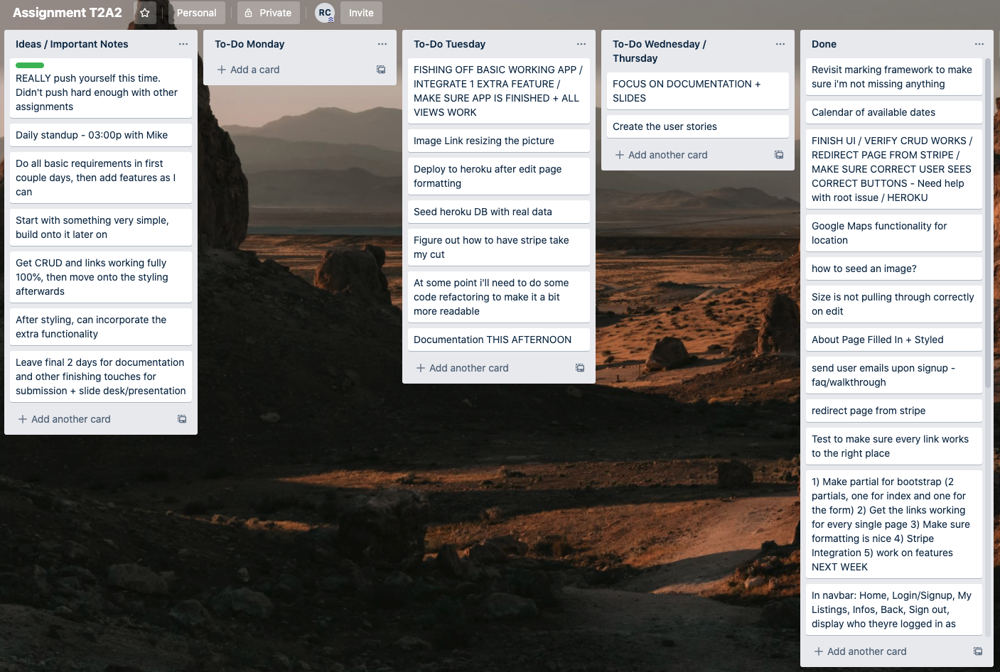